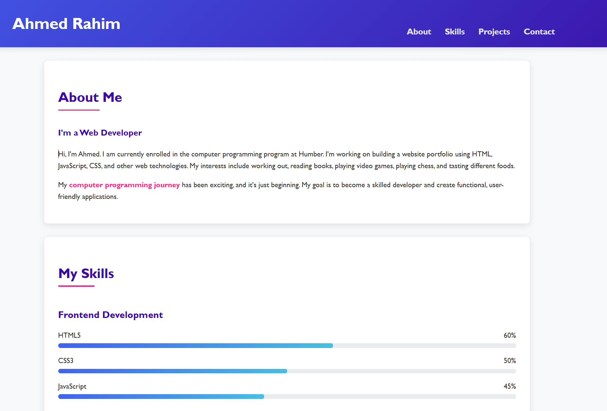

# Ahmed Rahim's Portfolio 🧔🏽💻

A modern, responsive portfolio showcasing my projects, skills, and journey as a web developer. Built with HTML, CSS, and JavaScript, featuring **dark mode**, **smooth animations**, and **lazy loading**.

 

---

## 🚀 Features
- **Dark/Light Mode Toggle** 🌓  
  Switch themes seamlessly with localStorage persistence.
- **Animated Skill Bars** 📊  
  Dynamic progress bars for technical skills.
- **Lazy-Loading Images** 🖼️  
  Optimized performance with Intersection Observer.
- **Interactive Contact Form** 📧  
  Real-time validation and success feedback.
- **Typed.js Integration** ⌨️  
  Animated "About Me" section with rotating roles.
- **Smooth Scrolling** ⚡  
  Seamless navigation between sections.

---

## 🛠️ Technologies Used
- **Frontend**: HTML5, CSS3, JavaScript (ES6+)
- **Libraries**: [Typed.js](https://github.com/mattboldt/typed.js/)
- **Tools**: Git, GitHub, Font Awesome Icons
- **Optimizations**: Minified CSS/JS, Compressed Images

---

## 🖥️ Live Demo
**[View Live Portfolio](https://hamoudi97.github.io/my-portfolio/)**  

---
